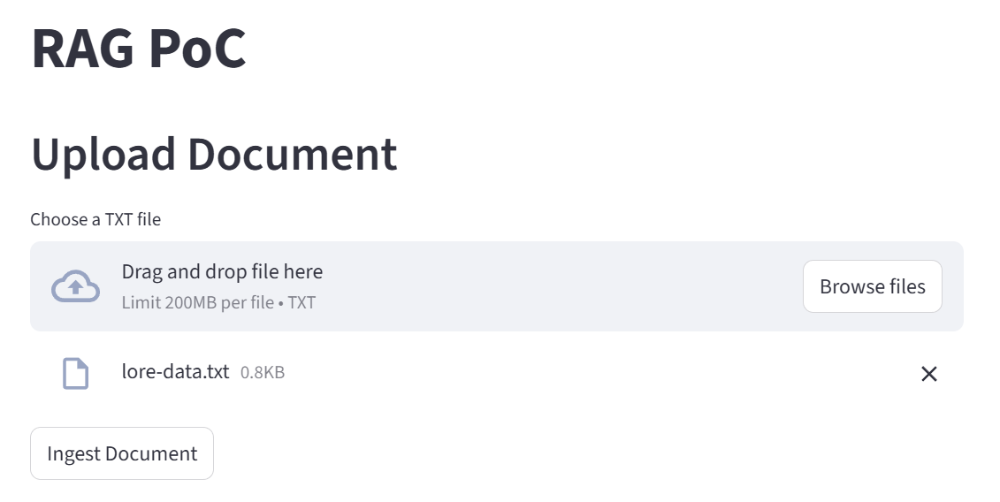
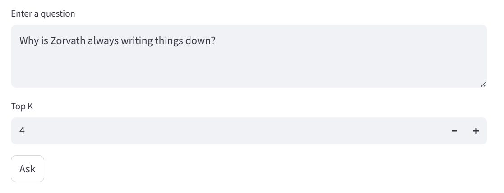
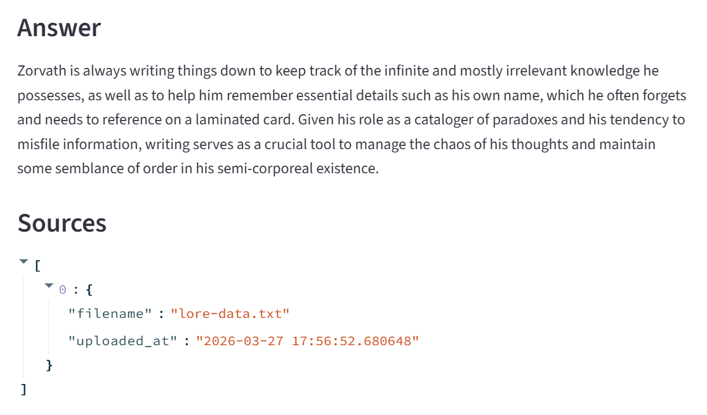

# RAG PoC

## Overview

This repository is a small Retrieval-Augmented Generation (RAG) proof-of-concept.

It includes:

- FastAPI backend
- Streamlit frontend
- OpenAI for embeddings and completion (via environment variable)
- Postgres + pgvector for vector storage
- Docker Compose for local development and easy EC2 deployment

This README focuses on how to build, initialize the database, and run tests locally and in containers.


## App demo

1. Tap "Browse files", select `tests/data/lore-data.txt`, then tap "Ingest Document".



2. Enter a question like "Why is Zorvath always writing things down?" and tap "Ask".



3. Review the answer and sources.



This demonstrates how a RAG app can answer questions
using extra information that you provide, that is not
commonly available or known by public apps like ChatGPT or Gemini.


## Running this application locally

### Prerequisites

 - Linux (or WSL, e.g. `\\wsl$\Ubuntu\home\$USER\...`)
 - Docker
 - git
 - An OpenAI API key (set via `OPENAI_API_KEY` in your `.env`)


### One-time setup

1) Copy the example environment and fill it in:

`cp .env.example .env`

Edit `.env` and set OPENAI_API_KEY and any DB credentials you want


### Build and run locally

1) Set env vars:

`source ./set-env.sh`

2) Build and start the stack:

`docker compose up -d --build`

3) First time only: Initialize the database (create pgvector extension and  documents table)

Run these commands after the `db` container is running.

```bash
docker compose exec db psql -U $POSTGRES_USER -d $POSTGRES_DB -c "CREATE EXTENSION IF NOT EXISTS vector;"
docker compose exec db psql -U $POSTGRES_USER -d $POSTGRES_DB -c 'CREATE TABLE IF NOT EXISTS documents (id TEXT PRIMARY KEY, content TEXT NOT NULL, embedding VECTOR(1536), metadata JSONB);'
```

4) Smoke test the backend and frontend

Backend: check health: `curl http://localhost:8000/health`

Frontend: open in browser: `http://localhost:8501`


### Running tests

Option A — run tests inside a container (matches CI)

This mounts the repository into a temporary backend container and runs pytest with the correct PYTHONPATH so the `backend` package is importable.

```bash
# from repo root (Bash)
docker compose run --rm -v "$PWD:/workspace" -w /workspace backend bash -lc "PYTHONPATH=/workspace pytest -q tests/backend -vv"
```

Option B — run tests locally in a venv

```bash
python3 -m venv .venv
source .venv/bin/activate
pip install -r backend/requirements.txt
pytest -q tests/backend -vv
```


### Using the app

You can now run the App Demo (at the top of this document) yourself!


## Appendix: Developer notes on how it works

When the /ingest API is called, it does this:

1. calls `emb = openai.embed_texts([text])` to translate to embedding format.
2. calls `vector_store.upsert(doc_id, text, emb[0], metadata)` to store in vector db.

When /query API is called, it does this:

1. calls `q_emb = openai.embed_texts([question])` to translate question to embedding format
2. calls `rows = vector_store.query(q_emb, top_k)` to query vector db for relevant data
3. creates a prompt like:
```
Use the following context to answer the question:
Context: (the information gathered from step 2, in embedding format)
Question: (the question from step 1, in enbedding format)
Answer:
```
4. calls `openai.generate_answer(prompt)`
